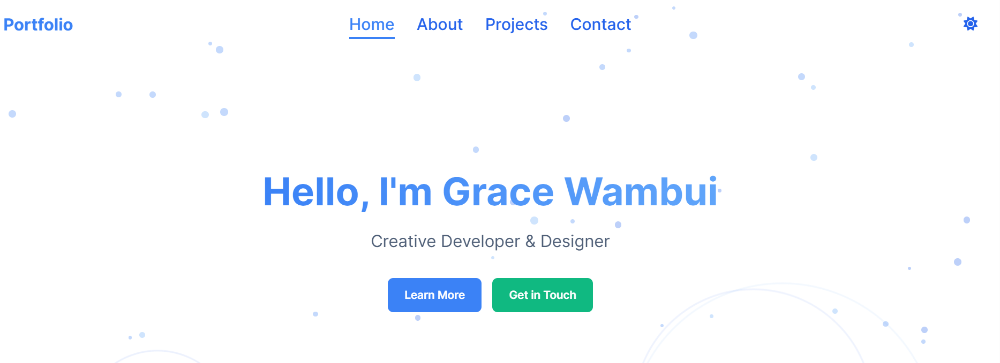

# Portfolio Website

A modern, responsive portfolio website built with HTML, CSS, and JavaScript. This project showcases a professional web developer's work, skills, and experience with an interactive and visually appealing design.



## Features

- **Responsive Design**: Fully responsive layout that works on all devices from mobile to desktop
- **Dark/Light Mode**: Toggle between dark and light themes with a persistent preference
- **Interactive Elements**: 
  - Animated particles background
  - Interactive project cards with hover effects
  - Personality quiz with results
  - Timeline of professional experience
- **Project Showcase**: Detailed modal views
- **Contact Options**: 
  - Conversational contact form
  - QR codes for contact information
  - Social media links
- **Gamification**: Achievement badges system to encourage exploration
- **Chatbot Assistant**: Virtual assistant to help visitors navigate the portfolio

## Technologies Used

1. HTML
2. CSS
3. JS

## How to Run

1. Clone the repository:
   ```git clone https://github.com/WambuiGrace/portfolio-website.git```
2. Navigate to the directory
    ```cd portfolio-website```
